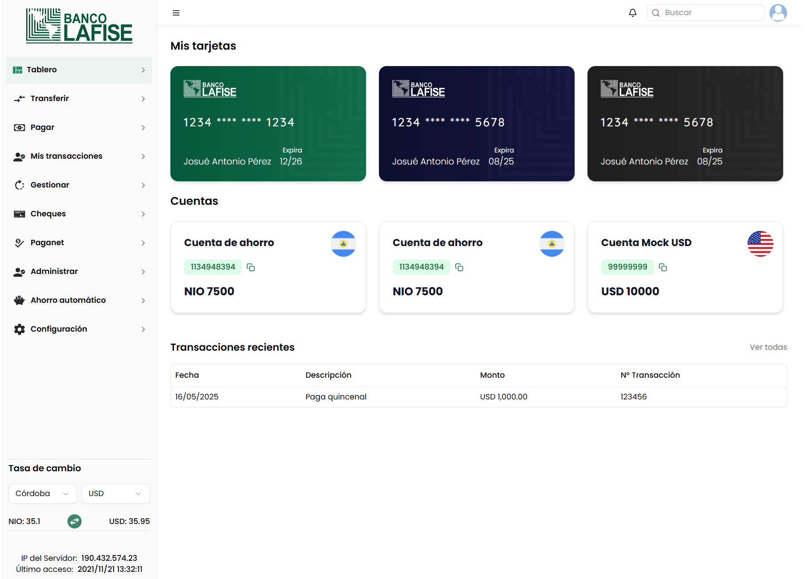

# Prueba Técnica - Desarrollador Frontend (Web)

# Producto finalizado  


## Objetivo:
Desarrollar una aplicación web en React basada en un diseño predefinido y consumiendo datos de un API.

## Requerimientos técnicos:

* Uso de React JS (web): La aplicación debe desarrollarse utilizando React Native.
* Gestión del Estado: Se debe usar Zustand como primera opción o Context API, Redux como segunda opción.
* Consumo de APIs: Realizar llamadas a las APIs Mock proporcionadas usando Axios.
* Navegación: Implementar navegación utilizando React Navigation o Expo Router.
* Estilización: Uso de UniStyles o Nativelwind para el diseño (`Tailwind` para web).
* Validaciones de Formularios: Uso de React Hook Form.
* Manejo de Errores: Implementar una estrategia para manejar errores en llamadas a la API.
* Uso de Hooks: Aplicar correctamente hooks como `useEffect` y `useState`.
* Código Limpio: Aplicar buenas prácticas en la estructura y organización del código.

## Descripción del Proyecto

* Pantalla de Inicio:
  * Se muestran las cuentas del usuario y el saldo (se debe consumir API Mock prevista).
  * Se muestran las opciones que el usuario puede realizar. 
  * Se muestran las transacciones del cliente (se debe consumir API Mock prevista).
* Pantalla para envio de dinero
   * Solicitar al usuario la cuenta de destino y el monto a enviar.
   * Se debe validar que el monto no sea negativo y que tampoco sea superior al saldo de la cuenta de origen.
* Pantalla de resumen de transferencia
   * Mostrar la información detallada de la transferencia a realizar.
   * Permitir que el usuario pueda confirmar la transferencia.
* Pantalla de finalización
   * Mostrar información de la transferencia realizada con éxito.
   * Permitir volver a la pantalla de inicio.

## Mock API:
* https://github.com/lafise/mobile-frontend-challenge-mock

---

## 🚀 Instrucciones de Instalación (Web)

1. **Clona el repositorio:**
   ```bash
   git clone https://github.com/cswni/propuesta-prueba-tecnica-lafise-nicaragua
   cd propuesta-prueba-tecnica-lafise-nicaragua
   ```

2. **Instala las dependencias:**
   ```bash
   npm install
   # o
   yarn install
   ```

3. **Configura las variables de entorno:**
   - Crea un archivo `.env` en la raíz del proyecto y copia el siguiente template:

   ```env
   VITE_USER_ID_MOCK=1134948394
   VITE_URL_API=http://localhost:5566/
   ```
   - Ajusta los valores según tu entorno o los datos de la API mock. En este caso levantar el servidor Mock sugerido para la prueba.

4. **Inicia la aplicación:**
   ```bash
   npm run dev
   # o
   yarn dev
   ```

5. **Abre en tu navegador:**
   - Visita [http://localhost:5173](http://localhost:5173) (o el puerto indicado en la terminal).

---

## 🛠️ Template de .env

```env
# ID de usuario mock para pruebas
VITE_USER_ID_MOCK=1134948394

# URL base de la API mock
VITE_URL_API=http://localhost:5566/
```
